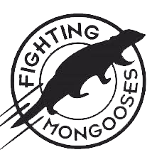

# The Fighting Mongooses Team

## Team Members

> Je Min Son

> Joseph Shea-Bianco

> Davis Holstege
-----------------------------------------------
[Domain](http://fightingmongooses.ddns.net/)
-----------------------------------------------
## Directory 

* image - containing image of the logo

* [week2](https://github.com/cis399-2017-team/The-Fighting-Mongooses/tree/master/week2) - Amazon EC2 instance creation

* [week3](https://github.com/cis399-2017-team/The-Fighting-Mongooses/tree/master/week3) - Puppet master/agent setup

* [week4](https://github.com/cis399-2017-team/The-Fighting-Mongooses/tree/master/week4) - Web service and basic load-balancing 

* [week5](https://github.com/cis399-2017-team/The-Fighting-Mongooses/tree/master/week5) - User Account Management

* [week6](https://github.com/cis399-2017-team/The-Fighting-Mongooses/tree/master/week6) - Monitoring, Measurement, and Notification 
